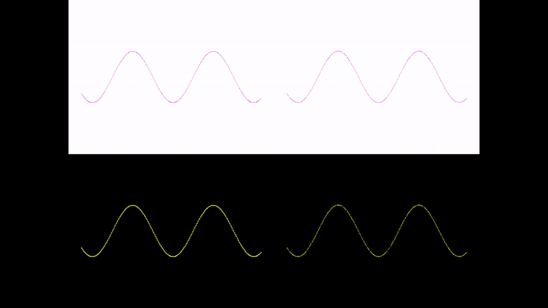

# Xiaolin Wu's Antialiased Line Algorithm
Wu, Xiaolin (July 1991). "An efficient antialiasing technique". ACM SIGGRAPH Computer Graphics. 25 (4): 143–152. doi:10.1145/127719.122734. ISBN 0-89791-436-8.

Xiaolin Wu’s 1991 algorithm was a pretty cool breakthrough in rendering smooth lines on raster displays. 
Unlike Bresenham’s method, which produces sharp, pixelated lines by selecting the nearest pixel, Wu’s algorithm computes partial pixel coverage for each line step and adjusts the pixel intensity accordingly.

Key features:

- Antialiasing: Reduces the jagged "stair-step" effect of digital lines.
- Intensity-based rendering: Pixels near the line path are drawn with a fraction of full intensity based on their distance to the ideal line.
- Efficiency: Runs in linear time and is simple enough for real-time rendering, even in the early 1990s.

At the time, Xiaolin Wu’s method provided one of the first practical ways to render smooth lines on CRT and early LCD displays without significantly increasing computational cost, improving both the visual quality and readability of graphics.

Note: Endpoint treatment differs slightly from the original 1991 algorithm. Also, I do not implicitly clamp intensities to `[0, 1]`, even though they do stay in that range.

# DEMO

